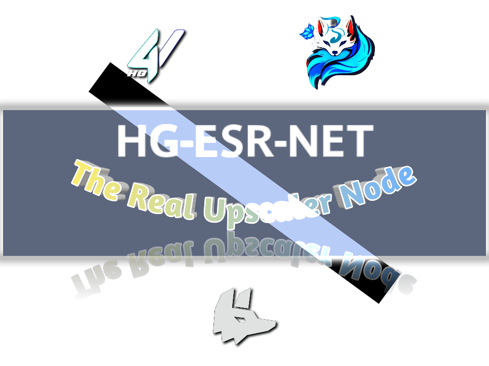

<p align="center">
  
</p>

<div align="center">

# HG-ESR-NET

**Universal Architecture Super-Resolution Inference Engine**

[](LICENSE)
[](#-dependencies-and-installation)
[](https://github.com/Hanzet22/HG-ESR-NET/issues)
[](https://github.com/Hanzet22/HG-ESR-NET/issues)

</div>

**HG-ESR-NET** is a universal super-resolution inference engine, built on top
of Real-ESRGAN's proven upscaling pipeline and extended with a hybrid
architecture-detection layer that auto-loads **25+ SR/restoration
architectures** from a single checkpoint file - no manual arch code required.

Point it at any `.pth` / `.safetensors` / `.ckpt` model from OpenModelDB,
HuggingFace, or your own training run, and it detects the architecture,
builds the network, and runs inference - the same way for ESRGAN, SPAN,
OmniSR, SwinIR, HAT, DAT, RealCUGAN, and everything else it supports.

---

## ✨ What HG-ESR-NET adds

- **Universal model loader** (`realesrgan/universal_loader.py`) - hybrid
  detection: tries [Spandrel](https://github.com/chaiNNer-org/spandrel)
  first (25+ architectures, auto hyperparameter inference from the raw
  state_dict), falls back to a hand-written `archs2/` registry
  (RRDBNet, SRVGGCompact, RealCUGAN 2x) for anything Spandrel doesn't
  recognize.
- **`--model_path` + `--arch`** - load *any* checkpoint directly, with an
  optional architecture hint for edge cases. No more hand-editing the
  inference script to add a new `nn.Module` every time you want to try a
  model from OpenModelDB.
- **`.pth` / `.safetensors` / `.onnx` / `.ckpt`** support out of the box.
  ONNX models run through a separate ONNXRuntime session (see
  `load_onnx_model()`), since an ONNX graph isn't a PyTorch state_dict and
  deserves an honest, separate code path rather than being forced through
  the same detector.
- **Python 3.11 / 3.12 ready** - `requirements.txt` and `setup.py` updated;
  `basicsr` is no longer a hard dependency for inference (it's still used
  for the original training pipeline, now an optional `pip install .[train]`
  extra - see [Training](docs/Training.md)).
- **`test_universal_loader.py`** - a sanity-check script: verifies your
  environment (torch/spandrel/CUDA), the fallback registry, and can load +
  dummy-forward-pass a real checkpoint before you trust it in production.
- **fp16/fp32 toggle**, tiling, pre-padding, and the rest of Real-ESRGAN's
  original inference options are preserved as-is.

---

## 🔧 Dependencies and Installation

- Python 3.11 or 3.12
- [PyTorch >= 2.2](https://pytorch.org/) (CUDA build recommended for GPU inference)

### Installation

```bash
git clone https://github.com/Hanzet22/HG-ESR-NET.git
cd HG-ESR-NET
pip install -r requirements.txt
```

Training extras (only needed if you're fine-tuning, not for inference):

```bash
pip install .[train]   # pulls in basicsr, facexlib, gfpgan
```

### Sanity check before first use

```bash
python test_universal_loader.py
# once that passes, point it at a real checkpoint:
python test_universal_loader.py --model_path weights/your_model.pth
```

---

## ⚡ Quick Inference

### Using any model (OpenModelDB / HuggingFace / your own)

```bash
python inference_realesrgan.py -i inputs/ --model_path weights/your_model.pth -o results/
```

Architecture and scale are auto-detected. If detection is ambiguous, force
it manually:

```bash
python inference_realesrgan.py -i inputs/ --model_path weights/model.pth --arch rrdbnet --scale 4
```

List architectures known to the fallback registry:

```bash
python inference_realesrgan.py --list_archs
```

### Using an official Real-ESRGAN checkpoint (auto-downloaded)

```bash
python inference_realesrgan.py -n RealESRGAN_x4plus -i inputs --face_enhance
```

```console
Usage: python inference_realesrgan.py -n MODEL_NAME -i infile -o outfile [options]...
   or: python inference_realesrgan.py --model_path PATH -i infile -o outfile [options]...

  -h                   show this help
  -i --input           Input image or folder. Default: inputs
  -o --output          Output folder. Default: results
  -n --model_name      Official model name (auto-downloaded). Ignored if --model_path is set.
  --model_path         Path to any local .pth/.ckpt/.pt/.safetensors checkpoint.
  --arch               Optional architecture hint for the archs2/ fallback.
  --scale              Upsampling scale. Usually auto-detected from the checkpoint.
  --list_archs         List archs2/ fallback architecture names and exit.
  -s, --outscale       The final upsampling scale of the image. Default: 4
  --suffix             Suffix of the restored image. Default: out
  -t, --tile           Tile size, 0 for no tile during testing. Default: 0
  --face_enhance       Whether to use GFPGAN to enhance face. Default: False
  --fp32               Use fp32 precision during inference. Default: fp16 (half precision).
  --ext                Image extension. Options: auto | jpg | png. Default: auto
```

Results are written to the `results/` folder.

---

## 🏰 Supported architectures

Handled automatically via Spandrel (no config needed): ESRGAN/RRDBNet,
SRVGGCompact, SPAN, OmniSR, SAFMN, HAT, DAT, SwinIR, Swin2SR, SRFormer, RGT,
DRCT, ATD, RealCUGAN (2x/2x_fast/3x/4x), PLKSR/RealPLKSR, RestoreFormer,
RetinexFormer, SCUNet, and more - see
[Spandrel's supported architectures](https://github.com/chaiNNer-org/spandrel#supported-architectures)
for the current full list.

Hand-written fallback (`archs2/`, used only if Spandrel doesn't recognize a
checkpoint): RRDBNet, SRVGGCompact, RealCUGAN 2x.

Architectures under restrictive/non-commercial licenses are available via
the separate `spandrel_extra_arches` package - see the licensing note in
[ATTRIBUTIONS.md](ATTRIBUTIONS.md) before enabling it for anything beyond
personal or non-commercial use.

---

## 📧 Contact

Questions or issues with **HG-ESR-NET**: `farhanzet4@gmail.com` or
`hypergarudatkj@gmail.com`.

For questions about the original Real-ESRGAN project this fork is based on,
see the credit section below.

---

## 🙏 Based on / Credits

HG-ESR-NET is a fork of **Real-ESRGAN**, with its inference/model-loading
path rebuilt around a universal architecture detector. The original
training pipeline, paper, and upstream project are fully credited below.
Full attribution for every architecture and library used is in
[ATTRIBUTIONS.md](ATTRIBUTIONS.md) - please read it before redistributing.

### Real-ESRGAN (original project)

> Wang, Xintao, Liangbin Xie, Chao Dong, and Ying Shan. "Real-ESRGAN:
> Training real-world blind super-resolution with pure synthetic data."
> ICCVW 2021.

[[Paper](https://arxiv.org/abs/2107.10833)] &emsp; [[Original repo](https://github.com/xinntao/Real-ESRGAN)]

[Xintao Wang](https://xinntao.github.io/), Liangbin Xie,
[Chao Dong](https://scholar.google.com.hk/citations?user=OSDCB0UAAAAJ),
[Ying Shan](https://scholar.google.com/citations?user=4oXBp9UAAAAJ&hl=en) -
Tencent ARC Lab; Shenzhen Institutes of Advanced Technology, Chinese Academy
of Sciences

```bibtex
@InProceedings{wang2021realesrgan,
    author    = {Xintao Wang and Liangbin Xie and Chao Dong and Ying Shan},
    title     = {Real-ESRGAN: Training Real-World Blind Super-Resolution with Pure Synthetic Data},
    booktitle = {International Conference on Computer Vision Workshops (ICCVW)},
    date      = {2021}
}
```

Original project contact: `xintao.wang@outlook.com` or `xintaowang@tencent.com`.

### Core dependencies this fork is built on

- **[BasicSR](https://github.com/XPixelGroup/BasicSR)** (XPixelGroup /
  Xintao Wang, Liangbin Xie, Ke Yu, Kelvin C.K. Chan, Chen Change Loy, Chao
  Dong) - reference architecture implementations the `archs2/` fallback is
  based on.
- **[Spandrel](https://github.com/chaiNNer-org/spandrel)** (chaiNNer team) -
  the primary architecture auto-detection and loading engine that powers
  this fork's universal model support.
- **[OpenModelDB](https://openmodeldb.info)** - optional convenience utility
  for browsing/downloading/converting model checkpoints.

See **[ATTRIBUTIONS.md](ATTRIBUTIONS.md)** for the complete list of
architectures, authors, papers, and license terms.

### Recommended related projects

- [GFPGAN](https://github.com/TencentARC/GFPGAN) - practical face restoration
- [BasicSR](https://github.com/XPixelGroup/BasicSR) - open-source image/video restoration toolbox
- [Spandrel](https://github.com/chaiNNer-org/spandrel) - universal PyTorch SR/restoration model loading
- [OpenModelDB](https://openmodeldb.info) - community model database
